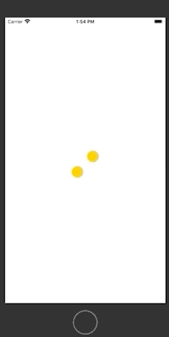
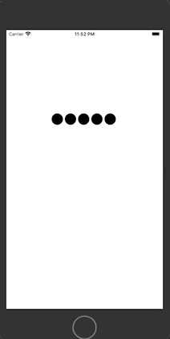
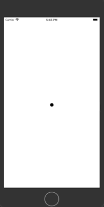
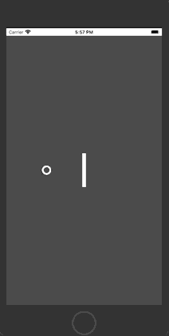
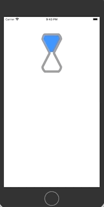
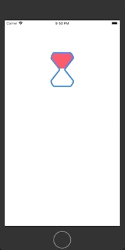
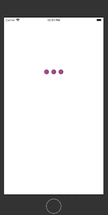
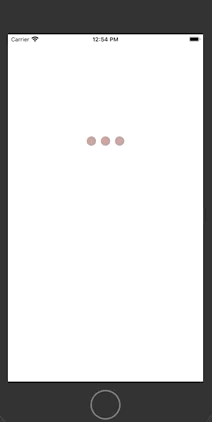
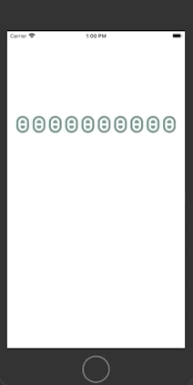

# Bunimation

> An animation library implemented with SwiftUI. 

## BuniLoading

> This is a loading indicator, you can customize it's background color.

### Examples

```swift
BuniLoading(circleColor: .blue)
```



## Buniball

> Buniball is a loading indicator. You can give your customized view, size, count (you need more than one), space between customized views, animation time and available movements which is up, down or both. 

### Usage

```swift
    init(animationTime: Double = 1, ballCount: Int = 6,
        ballSize: CGSize = CGSize(width: 24, height: 24),
        space: CGFloat = 8, 
        availableMovement: (up: Bool, down: Bool) = (true, true), 
        @ViewBuilder view: () -> AnimatedView)
```
### Examples

```swift
    Buniball(animationTime: 1, ballCount: 5, 
            ballSize: CGSize(width: 30, height: 30), 
            space: 5, availableMovement: (true, false)) {
            Circle()
        }
```


> Try avaliableMovement as (true, true)
```swift
    Buniball(animationTime: 1, ballCount: 5, 
            ballSize: CGSize(width: 30, height: 30), 
            space: 5, availableMovement: (true, true)) {
            Circle()
        }
```



> Try avaliableMovement as (false, true)
```swift
    Buniball(animationTime: 1, ballCount: 5, 
            ballSize: CGSize(width: 30, height: 30), 
            space: 5, availableMovement: (false, true)) {
            Circle()
        }
```


> Let's change animation view as below

```swift
ZStack {
    Capsule(style: .continuous)
        .foregroundColor(.accentColor)
    Capsule()
        .frame(width: 10, height: 10)
        .foregroundColor(.white)
}
```


## Bunibfall


## BuniCasper

> A ghost winked. 
    
### Example

```swift
BuniCasper()
```


## BuniClickedBall

> BuniClickedBall can use as loading indicator, button animation or something else. 

### Example

```swift
BuniClickedBall()
```



## BuniExplode

### Example

```swift
BuniExplode()
```



## BuniLetters

> You can show and hide your letters except the last one!

### BuniLettersViewModel

> This is the main object that manage this amazing animation. It has four published variables which are letters, interval, specialCharacterBackgroundColor and characterBackgroundColor.

**Interval** is the duration of state change from show to hide or vice versa.
**Letters** are shown. 
**specialCharacterBackgroundColor** is the background color of the last char.
**characterBackgroundColor** is the bacground color of chars except the last one.

#### Usage

```swift
init(text: String, interval: Double, specialCharacterBackgroundColor: Color, characterBackgroundColor: Color)
```

Text will parse and set to letters.

### ShouldShow

> ShouldShow is a bound parameter which you can change state of BuniLetters.

### BuniLetters Usage

```swift
init(viewModel: BuniLettersViewModel, shouldShow: Binding<Bool>)
```

### Example

```swift
@State var shouldShow: Bool = false

BuniLetters(viewModel: BuniLettersViewModel(text: "Barış", interval: 0.6, specialCharacterBackgroundColor: .red, characterBackgroundColor: .blue), shouldShow: $shouldShow)
```


## BuniSandglass

> BuniSandglass is a customizable sandglass animation.

### BuniSandglassViewModel

> This is the main object that manage this amazing animation. It has several published variables.

**lineWidth** is the line width of glass.
**size** of glass.
**sandColor** is the sand's color.
**boxColor** is the glass's color.
**balance** is the magic number to divesify glass's shape.

#### Usage

```swift
init(lineWidth: CGFloat, size: CGSize, sandColor: Color, boxColor: Color, balance: CGFloat)
```

### BuniSandglass Usage

```swift
init(viewModel: BuniSandglassViewModel)
```

### Example

```swift
Sandglass(viewModel: BuniSandglassViewModel(lineWidth: 10, 
                                            size: CGSize(width: 80, height: 160), 
                                            sandColor: .blue, 
                                            boxColor: .gray, 
                                            balance: 10))
```


> Let's customize!

```swift
Sandglass(viewModel: BuniSandglassViewModel(lineWidth: 5, 
                                            size: CGSize(width: 80, height: 150), 
                                            sandColor: .orange, 
                                            boxColor: .black, 
                                            balance: 3))
```


```swift
Sandglass(viewModel: BuniSandglassViewModel(lineWidth: 5, 
                                            size: CGSize(width: 80, height: 120), 
                                            sandColor: .pink, 
                                            boxColor: .blue, 
                                            balance: 10))
```



## BuniSnake

> You can move your own view as snake while dragging and you can add its shadow as well. 

### BuniSnakeViewModel

**animatedView** is your custom view.
animatedView **count**.
**space** between animated views.
**objectColor** background color of your animated view. Default is random.
**shouldShadow** is determined shadow's visibility.

#### Usage

```swift
init(count: Int = 5, space: CGFloat = 0, shouldShadow: Bool = false, objectColor: Color = .random, @ViewBuilder view: () -> AnimatedView)
```

### BuniSandglass Usage

```swift
init(viewModel: BuniSnakeViewModel<AnimatedView>)
```

#### Signature

```swift
struct BuniSnake<AnimatedView: View>: View
```

### Example

```swift
BuniSnake(viewModel: BuniSnakeViewModel(count: 3, space: 10, shouldShadow: false, view: {
    Circle()
            .frame(width: 20, height: 20)
}))
```



> Let's try to set shouldShadow as true

```swift
BuniSnake(viewModel: BuniSnakeViewModel(count: 3, space: 10, shouldShadow: true, view: {
    Circle()
            .frame(width: 20, height: 20)
}))
```



```swift
BuniSnake(viewModel: BuniSnakeViewModel(count: 10, space: 8, shouldShadow: false, view: {
    ZStack {
        Capsule()
            .frame(width: 30, height: 40)
        Capsule()
            .frame(width: 20, height: 30)
            .foregroundColor(.white)
        Capsule()
            .frame(width: 10, height: 20)
        Rectangle()
            .frame(width: 10, height: 5)
            .foregroundColor(.white)
    }
}))
```



## BuniWayf

> Buniwayf is a loading indicator or wifi search animation.

### BuniWayfViewModel

**backgroundColor** is a base color of animation.
**wayfColor** is a foreground color of inner objects.

#### Usage

```swift
init(backgroundColor: Color, wayfColor: Color)
```

### BuniWayf Usage

```swift
init(viewModel: BuniWayfViewModel)
```

### Example

```swift
BuniWayf(viewModel: .init(backgroundColor: .blue, wayfColor: .black))
```


```swift
BuniWayf(viewModel: .init(backgroundColor: .blue, wayfColor: .black))
```


## Meta

Barış UYAR – [@prospectcha](https://twitter.com/prospectcha) – baris.uyar@hotmail.com

[Github](https://github.com/barisuyar)
